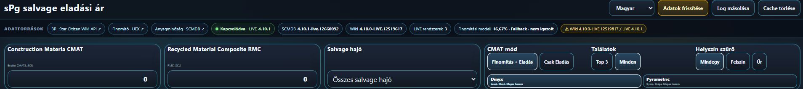

# sPg Star Citizen Vehicle Reference Downloader V001

[English README](README.en.md)

Az **sPg Star Citizen Vehicle Reference Downloader** egy egyfájlos, helyben futó böngészős segédeszköz Star Citizen hajók és földi járművek referencia-képeinek összegyűjtéséhez. A Star Citizen Wiki adataiból kiválaszt egy járművet, felismeri a releváns külső nézeteket, előnézetet mutat, majd az eredeti képeket és az opcionális lefelé méretezett változatokat egységes fájlnevekkel egy ZIP-be rendezi.

> **V001 kiadási állapot:** `STATICALLY VERIFIED ONLY` — a csomag statikus, integritási és dokumentációs gate-jei teljesültek, és az Esperia Prowler Utility media → Blob → ZIP lánc valós runtime teszten PASS. A V001 kötelező `file://` futási módja és a konkrét böngésző/verzió ugyanebben a tesztben nincs bizonyítva, ezért a böngészős runtime gate még blokkolt. A GitHubra publikált repository státusza a kézi feltöltés és a fresh-clone parity ellenőrzés előtt `BLOCKED`.

## Fő artifact

`sPg_Star_Citizen_Vehicle_Reference_Downloader_V001.html`

A program továbbra is **single-file HTML**: a CSS, JavaScript és ZIP-író a HTML-ben van. A GitHub-struktúra nem bontja szét a futó alkalmazást.

Canonical V001 SHA-256:

`3bb0b10d5794f36346b0752d05aa3bc5dac90d4b21b4318c6b909834b7e4695b`

## Mit tud a V001?

- járműtípus-szűrés: **Mind / Hajók / Földi járművek**;
- dinamikus **Gyártó → Jármű** választás Wiki-adatból;
- kézzel beilleszthető Star Citizen Wiki URL;
- `In space` / kompatibilis képcsoport-felismerés és nézetnév-normalizálás, például `Port` → `Port-side`;
- nagy előnézet és nézetkártyák;
- eredeti kép csak ZIP-készítéskor töltődik le;
- `Original`, `2048px`, `1280px`, Contact Sheet és forrásmanifest export;
- egységes, teljes fájlnevek;
- helyi katalógus-cache, utolsó 5 jármű és beállítások `localStorage`-ban;
- egykattintásos, rejtett háttérdiagnosztikából készülő JSON-log;
- játékadat-verzió és katalógusváltozás követése a V001 jelenlegi logikája szerint.

## Gyors használat

1. Töltsd le a `sPg_Star_Citizen_Vehicle_Reference_Downloader_V001.html` fájlt.
2. Nyisd meg böngészőben.
3. Válassz járműtípust, gyártót és járművet, vagy adj meg Wiki URL-t.
4. Ellenőrizd az előnézetben a megtalált nézeteket.
5. Válaszd ki az exportálandó képverziókat.
6. Nyomd meg a **ZIP letöltése** gombot.
7. Hibánál a **Log mentése** gombbal készíts diagnosztikai JSON-t.

Nincs szükség Pythonra, Node.js-re, helyi szerverre vagy telepítőre a program használatához. Internetkapcsolat kell a Wiki/API és a képfájlok eléréséhez, valamint a beágyazott Google Fonts betöltéséhez.

## Hálózati modell

A V001 szándékosan nem tölti le előre az összes jármű képét.

1. **Indulás:** katalógus és metaadat.
2. **Jármű kiválasztása:** csak az adott jármű média-metaadatai és előnézetei.
3. **ZIP-kérés:** csak ekkor érkeznek le a kiválasztott jármű teljes felbontású eredeti képei.

A `Mind` csak a járműlistát bővíti; nem jelent tömeges képletöltést.

## Exportnév-szabály

ZIP:

`<Teljes gyártó> <Jármű> - Reference Pack.zip`

Képfájl:

`<Teljes gyártó> <Jármű> - <Nézet> - <Képverzió>.<ext>`

Példa:

`Esperia Prowler Utility - Port-side - Original.jpg`

Az Original bájtra az eredeti Wiki-fájl marad. A 2048px és 1280px V001-ben PNG, kizárólag lefelé méretezve, közvetlenül az eredetiből.

## Valós V001 bizonyíték

A `test-artifacts/09_TEST_Prowler_Utility_manifest.json` valós, sikeresen elkészült V001 ZIP-ből származó runtime manifest. Bizonyítja az Esperia Prowler Utility esetén:

- 6/6 `In space` nézet: Isometric, Above, Port-side, Front, Rear, Below;
- Original: 3840×2160 JPG;
- 2048px: 2048×1152 PNG;
- 1280px: 1280×720 PNG;
- Contact Sheet: 2048×908 PNG;
- `..._in_space_-_Port.jpg` → `Port-side` normalizálás;
- `game_data_version = 4.10.1-LIVE.12660092`;
- működő `media.starcitizen.tools` → CORS/fetch → Blob → helyi feldolgozás → ZIP lánc.

**Nem bizonyított ebből a tesztből:** a pontos `file://` protokoll, a böngésző neve és verziója. MOLE, Polaris, Carrack, többtabos hajó és földi jármű V001 E2E tesztje szintén nincs még bizonyítva.

## Adatforrások

A V001 két Wiki-réteget használ:

- `https://api.star-citizen.wiki/api` — játékadat-verzió, járműkatalógus, keresés/jármű metaadat;
- `https://starcitizen.tools/api.php` — MediaWiki Action API oldal- és médiafelismeréshez, `origin=*` paraméterrel.

A részletes endpointlista, cache- és fallback-logika: [docs/SPECIFICATION.md](docs/SPECIFICATION.md) és [docs/DATA_SOURCES_AND_LEGAL.md](docs/DATA_SOURCES_AND_LEGAL.md).

## Adatvédelem

A programnak nincs saját backendje, fiókrendszere vagy beépített analytics rendszere. A V001:

- `localStorage`-ot használ katalógus-, verzió-, recent- és beállítás-cache-hez;
- hálózati kéréseket küld a Star Citizen Wiki API-khoz és a `media.starcitizen.tools` kiszolgálóhoz;
- a beágyazott CSS Google Fonts importja miatt online használatkor a böngésző a Google Fonts infrastruktúrájához is kapcsolódhat;
- a diagnosztikai log helyben készül és felhasználói műveletre töltődik le.

Részletek: [PRIVACY.md](PRIVACY.md).

## Licenc és fan projekt státusz

A projekt saját forráskódja **MIT License** alatt kerül kiadásra. Ez ugyanaz a licenctípus, mint a `DuczaPeter/sPg-salvage-eladasi-ar` repositoryban.

Ez egy **nem hivatalos Star Citizen rajongói eszköz**, nincs kapcsolatban a Cloud Imperium cégcsoporttal, és nem állít hivatalos jóváhagyást. Star Citizen, Roberts Space Industries, Cloud Imperium és a kapcsolódó nevek, védjegyek, játékassetek a megfelelő jogaik tulajdonosaihoz tartoznak.

A repository **nem tartalmaz** a Wikiről letöltött hajóképeket. A korábbi MOLE screenshot referencia azért maradt ki, mert Star Citizen/CIG képi anyagot tartalmaz. A saját sPg felületből származó `assets/ui-topbar-style-reference.png` kizárólag vizuális stílusreferencia, **nem V001 runtime screenshot**.

A Wiki általános szöveges tartalma CC BY-SA 4.0-ként van jelölve, egyes médiafájlok saját licencinformációt és Star Citizen IP-re vonatkozó további korlátozást hordozhatnak. A Wiki API dokumentáció kifejezetten fejlesztői/fansite/bot használatot ír le; külön, teljes API ToS/rate-limit szerződést ehhez a release-hez nem sikerült hitelesen azonosítani, ezért ennek státusza `UNKNOWN / ATTENTION`. Lásd [THIRD_PARTY_NOTICES.md](THIRD_PARTY_NOTICES.md).

## Vizuális stílusreferencia

A kép egy másik, saját sPg eszköz felületének képernyőképe, és kizárólag a közös sPg design language-et dokumentálja. **Nem a Vehicle Reference Downloader V001 runtime screenshotja.**

## Release validáció

Statikus release gate:

`python tools/check_release.py`

Ez **nem** helyettesít böngészős runtime tesztet. A pontos gate-állapot és a V002 sorrend: [STATUS.md](STATUS.md), [docs/VALIDATION.md](docs/VALIDATION.md), [docs/ROADMAP.md](docs/ROADMAP.md).

## Dokumentáció

- [STATUS.md](STATUS.md) — aktuális release állapot;
- [docs/SPECIFICATION.md](docs/SPECIFICATION.md) — funkcionális specifikáció;
- [docs/EXPORT_RULES.md](docs/EXPORT_RULES.md) — normatív export- és fájlnévszabályok;
- [docs/DESIGN.md](docs/DESIGN.md) — sPg vizuális rendszer;
- [docs/ARCHITECTURE.md](docs/ARCHITECTURE.md) — komponensek és adatfolyam;
- [docs/DECISIONS.md](docs/DECISIONS.md) — mérnöki döntések;
- [docs/DATA_SOURCES_AND_LEGAL.md](docs/DATA_SOURCES_AND_LEGAL.md) — források és jogi státusz;
- [docs/VALIDATION.md](docs/VALIDATION.md) — bizonyítékok és tesztmátrix;
- [docs/ROADMAP.md](docs/ROADMAP.md) — V002 sorrend;
- [docs/DEVELOPMENT_HANDOFF.md](docs/DEVELOPMENT_HANDOFF.md) — más fejlesztő/AI folytatási rend;
- [docs/RELEASE_STANDARD.md](docs/RELEASE_STANDARD.md) — canonical V4.2 release szabvány.
