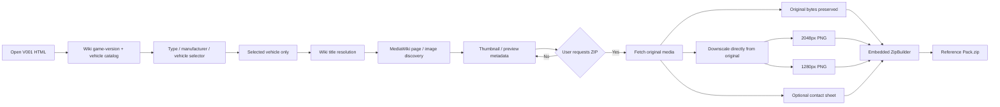

# Architecture

## Runtime shape

V001 is one browser artifact:

`sPg_Star_Citizen_Vehicle_Reference_Downloader_V001.html`

CSS, UI markup, JavaScript, data-source adapters, diagnostics, image processing, and the ZIP writer are embedded in that file. Repository documentation and release tooling surround the artifact but are not runtime dependencies.

## Data flow

## Source adapters

### Star Citizen Wiki API

Base:

`https://api.star-citizen.wiki/api`

V001 uses it for current game-data version, paged vehicle catalog, search, and vehicle metadata.

### MediaWiki Action API

Endpoint:

`https://starcitizen.tools/api.php`

V001 uses `origin=*` and MediaWiki actions for canonical title/redirect handling, page parsing, image discovery, and `imageinfo`.

### Media delivery

Original files are fetched from URLs returned by Wiki `imageinfo`, typically under `media.starcitizen.tools`.

## Selection model

The primary selection flow is:

`Vehicle type → Manufacturer → Vehicle`

`All` means both vehicle categories are visible in the list. It never means “download everything”.

Spacecraft vs ground vehicle is derived from structured vehicle data (`is_spaceship` / vehicle-like fields), not from name heuristics.

The URL-analysis path and dropdown path converge on the same selected-vehicle/media pipeline.

## Media model

V001 discovers media from the actual Wiki page/media data rather than constructing guessed filenames.

Known view names are normalized only when confidence is sufficient; a demonstrated example is:

`Port` → `Port-side`

Ground vehicles are not forced into a six-view spacecraft template. The application works from media actually found.

V001 still has known detection looseness: negative scoring is used for some non-target media instead of absolute exclusion. V002 priority item **h** tightens this.

## Network load model

1. startup: metadata/catalog;
2. selection: one selected vehicle's media metadata/previews;
3. ZIP click: original media bytes for that vehicle only.

Downscaled images are produced locally, so the original source image is fetched once.

## Storage

V001 uses browser `localStorage` for:

- catalog cache;
- current/previous version information;
- version history;
- five recent vehicles;
- UI/export settings.

There is no project backend database.

## Diagnostics

Diagnostics are maintained in memory with a bounded event history (`maxLog: 1200`) and exported on demand as JSON.

The export includes browser environment, protocol, selected vehicle, source/API state, request/error evidence, and JavaScript exceptions. It is intended not to contain image bytes, cookies, or auth tokens.

## ZIP implementation

V001 embeds its own `ZipBuilder` and writes ZIP entries in STORE mode. There is no CDN/runtime ZIP library.

## Critical invariants

- main artifact remains single-file;
- V001 baseline bytes do not change during release packaging;
- Original image bytes are not re-encoded;
- derivatives are downscaled directly from Original, never chained;
- no upscaling / AI upscaling;
- filenames contain full vehicle identity, view, and version;
- no eager all-vehicle image download;
- public repository does not redistribute downloaded Star Citizen vehicle media;
- static checks are never described as runtime tests.
